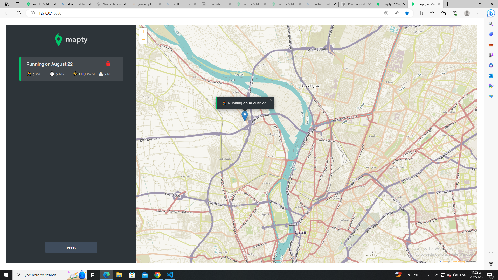

# Project Mapty App

Welcome to the Mapty App project! This web application allows you to track your workouts by recording your location, distance, time, and other metrics using the browser's built-in geolocation and local storage APIs. You can create a new workout by selecting the type of activity (running or cycling), entering the workout details, and clicking on the map to set the starting and ending points of your workout.

# live demo
- [👉Live demo👈](https://youssef-ashraf-ramadan.github.io/Mapy-App/)

## Features
- Track your workouts by recording your location, distance, time, and other metrics.
- Choose between running or cycling as the type of activity.
- See your workouts on a map with different markers for each activity type.
- View a list of all your workouts with details such as distance, time, speed, and elevation gain.
- Edit or delete your workouts as needed.
- Save your workout data to local storage so that it persists even after you close the browser.
- Ability to delete all Workouts
- Ability to delete a workout (with marker on the map)
- Ability to sort data based on duration in ASC Order
  

### Built with

- CSS custom properties
- Javascript
- Object Oriented Programming (OOP)

#### Screenshot👇

#### App Architecture👇

#### App Flowchart👇

